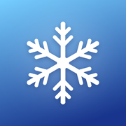

<p align="center">
  
</p>

<h1 align="center">LumenBoard</h1>

<p align="center">
  Icon theme engine for iOS 17 - 26<br>
  Works with SnowBoard, Anemone and WinterBoard themes
</p>

---

## Features

- Themes every app icon: home screen, dock, App Library, Spotlight, Settings, notifications
- Icons are rendered before the respring, nothing pops in afterwards
- Use several themes at once and drag them into the order you like
- Theme icons keep their own shape, or use the iOS shape
- Dark and tinted icons on iOS 18
- App in English and German

## Supported jailbreaks

| Type | Jailbreaks | Package |
| --- | --- | --- |
| rootless | Dopamine, palera1n | `iphoneos-arm64` |
| roothide | Relaxin, Bootstrap, Dopamine-roothide | `iphoneos-arm64e` |

## Install

1. Download the .deb for your jailbreak from [Releases](../../releases/latest)
2. Install it with Sileo, Zebra or Filza
3. Put your themes in `/Library/Themes` (rootless: `/var/jb/Library/Themes`)
4. Open LumenBoard, turn on your themes and tap **Apply**

> Don't use it together with SnowBoard, Anemone or NeonBoard. Themes that need SnowBoard or Anemone install fine.

## Theme format

```
MyTheme.theme/
├── IconBundles/
│   ├── com.apple.mobilesafari-large.png
│   ├── com.apple.mobilesafari-dark.png     (optional)
│   └── com.apple.mobilesafari-tinted.png   (optional)
└── Icons/
    └── Safari.png                          (by app name)
```

## Building

```sh
make package                                 # rootless
make package THEOS_PACKAGE_SCHEME=roothide   # roothide, needs roothide/theos
```

Logos needs to be on `a623700`, newer versions break lines that continue after `%orig`.

## License

MIT
